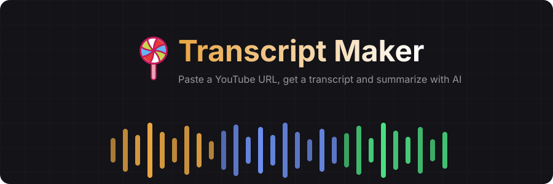

<p align="center">
  
</p>

<p align="center">
  Paste a YouTube URL, get a transcript and summarize with AI.
</p>

<p align="center">
  <a href="https://github.com/dmitry-kostin/transcript-maker/actions/workflows/tests.yml"></a>
  
  <a href="LICENSE"></a>
</p>

---

# 🍭 Transcript Maker – Watch Videos Faster Reading Them

<p align="center">
  
</p>

## Features

**Transcription**
- **YouTube → transcript** — paste a URL, get a full text via OpenAI Whisper or Google Gemini (switch providers in the UI)
- **AI summarization** — custom or default prompt, stored alongside the transcript
- **Speaker diarization** — optional speaker labels (`A:`, `B:`)
- **Duration limit** — transcribe only the first N minutes of a video

**Reliability**
- **Smart caching** — audio cached after first download; interrupted multi-chunk jobs resume from the last completed chunk
- **Re-transcribe** — re-run any transcript with a different model or provider

**Experience**
- **Real-time progress** — SSE-streamed stage updates with per-chunk ETA; cancel anytime
- **History** — expandable cards with status tracking, inline preview, persistent across restarts

**Export**
- **Copy / Download** — tab-aware (transcript or summary), clipboard or `.txt`
- **Obsidian export** — one-click send via `obsidian://` URI scheme
- **Show in Finder** — reveal the `.md` file on disk

**Storage**
- **Markdown files** — plain `.md` with YAML frontmatter, no database

## UI

<p align="center">
  <strong>AI summarization prompt</strong><br><br>
  
</p>

<p align="center">
  <strong>Obsidian vault connection</strong><br><br>
  
</p>

## Tech Stack

- Python 3.11+, FastAPI, uvicorn
- yt-dlp (YouTube download)
- OpenAI Whisper API (transcription)
- Google Gemini API (transcription + summarization, via OpenAI-compatible endpoint)
- OpenAI Chat API (summarization)
- ffmpeg / ffprobe (audio chunking)
- pydantic-settings (configuration)
- sse-starlette (SSE streaming)
- Vanilla HTML / CSS / JS (no build step)

## Quick Start

**Prerequisites:** Python 3.11+, [Poetry](https://python-poetry.org/docs/#installation), [ffmpeg](https://ffmpeg.org/) (`brew install ffmpeg` / `apt install ffmpeg`), and an API key from [OpenAI](https://platform.openai.com/api-keys) or [Google](https://aistudio.google.com/apikey) (or both).

```bash
git clone https://github.com/dmitry-kostin/transcript-maker.git
cd transcript-maker
poetry install

# Configure at least one provider (.env file or shell exports)
# OpenAI — for Whisper transcription + GPT summarization
echo "TM_OPENAI_API_KEY=sk-..." >> .env

# Google Gemini — for Gemini transcription + summarization
echo "GOOGLE_API_KEY=AIza..." >> .env        # no TM_ prefix

# Start the server
poetry run python run.py
```

You need at least one API key (OpenAI or Google) — both are optional individually. When both keys are configured, a provider selector appears in the UI to switch between them. Demo mode (`?demo`) works without any API keys.

Open http://127.0.0.1:8000 in your browser.

### Demo Mode

To test the UI without a real API key or internet connection, add `?demo` to the URL:

```
http://127.0.0.1:8000?demo
```

Demo mode simulates the full pipeline (5s download + 5s transcription) with fake data. No YouTube downloads or API calls are made. Multi-chunk progress appears randomly (~50% of the time) to exercise the chunk waveform UI.

## Configuration

All settings use the `TM_` prefix and can be set via environment variables or a `.env` file.

| Variable | Default | Description |
|---|---|---|
| `TM_OPENAI_API_KEY` | *(required)* | OpenAI API key |
| `GOOGLE_API_KEY` | *(optional)* | Google API key for Gemini models (no `TM_` prefix) |
| `TM_TEMP_DIR` | `./tmp` | Directory for temporary audio files |
| `TM_RESULTS_DIR` | `./results` | Directory for saved transcript `.md` files |
| `TM_MAX_CHUNK_SIZE_MB` | `24.0` | Max size per audio chunk sent to Whisper |
| `TM_AUDIO_FORMAT` | `mp3` | Audio format for yt-dlp extraction |
| `TM_TRANSCRIBE_MODEL` | `gpt-4o-transcribe` | Default transcription model (supports `gemini-*`) |
| `TM_SUMMARIZE_MODEL` | `gpt-4o` | Default summarization model (supports `gemini-*`) |
| `TM_OPENAI_TRANSCRIBE_MODEL` | `gpt-4o-transcribe` | OpenAI transcription model for provider selector |
| `TM_OPENAI_SUMMARIZE_MODEL` | `gpt-4o` | OpenAI summarization model for provider selector |
| `TM_GEMINI_TRANSCRIBE_MODEL` | `gemini-3-flash-preview` | Gemini transcription model for provider selector |
| `TM_GEMINI_SUMMARIZE_MODEL` | `gemini-3-flash-preview` | Gemini summarization model for provider selector |

## Project Structure

```
transcript-maker/
├── pyproject.toml          # Poetry deps & metadata
├── run.py                  # Single-script launcher (uvicorn)
├── .env.example            # Template for API key
├── .gitignore
├── app/
│   ├── __init__.py
│   ├── main.py             # FastAPI app factory, logging setup, startup log
│   ├── config.py           # pydantic-settings (env vars)
│   ├── api.py              # API routes (transcribe + history endpoints)
│   ├── clients.py          # Shared OpenAI/Gemini client helpers
│   ├── downloader.py       # yt-dlp: download + extract audio
│   ├── transcriber.py      # ffmpeg chunking + OpenAI/Gemini transcription
│   ├── summarizer.py       # Chat Completions for summarization (OpenAI + Gemini)
│   ├── history.py          # Persistence layer (markdown files)
│   └── static/
│       ├── index.html
│       ├── style.css
│       └── app.js
├── tests/
│   ├── conftest.py         # Shared fixtures
│   ├── test_history.py     # History module tests
│   ├── test_downloader.py  # Downloader unit tests (mocked yt-dlp)
│   ├── test_transcriber.py # Transcriber unit tests (mocked ffmpeg)
│   ├── test_summarizer.py  # Summarizer unit tests
│   ├── test_validation.py  # URL validation tests
│   ├── test_api_endpoints.py # API endpoint tests (TestClient)
│   └── test_integration.py # End-to-end tests (real APIs)
├── tmp/                    # Runtime temp files (gitignored)
└── results/                # Saved transcripts as .md files (gitignored)
```

## API Reference

| Method | Path | Description |
|---|---|---|
| `GET` | `/` | Serve the single-page UI |
| `GET` | `/static/{path}` | Serve CSS / JS assets |
| `POST` | `/api/transcribe` | Start transcription (returns SSE stream) |
| `GET` | `/api/history` | List all saved transcription records |
| `GET` | `/api/history/{id}` | Get single record with transcript body |
| `POST` | `/api/history/{id}/retranscribe` | Re-transcribe with optional model change (SSE stream) |
| `POST` | `/api/history/{id}/reveal` | Open Finder with the transcript file selected |
| `DELETE` | `/api/history/{id}` | Delete a saved transcript |
| `POST` | `/api/cleanup` | Clean up temp files and stale records |
| `GET` | `/api/providers` | List available model providers |
| `POST` | `/api/history/{id}/summarize` | Generate AI summary for a transcript |
| `GET` | `/api/history/{id}/summary` | Get stored summary for a transcript |
| `POST` | `/api/demo/transcribe` | Demo: simulated transcription (SSE stream) |
| `POST` | `/api/demo/history/{id}/retranscribe` | Demo: simulated re-transcription (SSE stream) |
| `POST` | `/api/demo/history/{id}/summarize` | Demo: simulated summarization |

### POST /api/transcribe

**Request:**
```json
{
  "url": "https://www.youtube.com/watch?v=dQw4w9WgXcQ",
  "model": "gpt-4o-transcribe",
  "diarize": true,
  "duration_limit": 30
}
```

- `url` — YouTube video URL (required)
- `model` — Transcription model (optional, default `gpt-4o-transcribe`). Supports OpenAI models (`gpt-4o-transcribe`) and Gemini models (`gemini-*`).
- `diarize` — Enable speaker detection (optional, default `false`). Appends `-diarize` suffix to the stored model name.
- `duration_limit` — Transcribe only the first N minutes (optional, default `0` = no limit, max `480`). Converted to seconds internally.

Accepted YouTube hostnames: `youtube.com`, `www.youtube.com`, `m.youtube.com`, `youtu.be`. Returns 422 for non-YouTube URLs or playlist URLs.

**Response:** Server-Sent Events stream with these event types:

| Event | Payload | When |
|---|---|---|
| `progress` | `{"stage": "...", "message": "...", "record_id": "...", "chunk": N, "chunks_total": N, "eta_seconds": N}` | Each pipeline stage (chunk/eta fields during transcription) |
| `transcript` | `{"text": "...", "title": "...", "duration_seconds": N, "duration_limit": N, "model": "...", "record_id": "..."}` | Transcription complete |
| `error` | `{"message": "...", "record_id": "..."}` | On failure |
| `done` | `{}` | Stream finished |

### POST /api/history/{id}/retranscribe

Re-transcribes an existing record using its stored URL. Returns an SSE stream identical to `/api/transcribe`. Audio is cached after the first download. Re-transcribe reuses cached audio without re-downloading from YouTube.

**Request:**
```json
{
  "model": "gpt-4o-transcribe",
  "diarize": false,
  "duration_limit": 0
}
```

- `model` — Transcription model (optional, same as `/api/transcribe`)
- `diarize` — Enable speaker detection (optional, default `false`)
- `duration_limit` — Transcribe only the first N minutes (optional, default `0` = no limit, max `480`)

Returns 400 for invalid ID, 404 if not found, 409 if the record is currently `in_progress`.

### POST /api/history/{id}/summarize

Generate an AI summary for a completed transcript.

**Request:**
```json
{ "prompt": "Summarize the key points", "model": "gpt-4o" }
```

- `prompt` — Custom summarization prompt (optional, empty string uses default prompt)
- `model` — Summarization model (optional, uses `TM_SUMMARIZE_MODEL` default). Supports `gemini-*` models.

**Response:**
```json
{
  "summary": "Video Title\n\nGenerated summary text...",
  "prompt": "Summarize the key points"
}
```

Returns 400 for invalid ID or incomplete record, 404 if not found, 500 if summarization fails.

### GET /api/history/{id}/summary

Retrieve a previously generated summary.

**Response:**
```json
{
  "summary": "Video Title\n\nSummary text...",
  "prompt": "Summarize the key points",
  "created_at": "2026-02-19T10:35:00"
}
```

Returns 400 for invalid ID, 404 if no summary exists.

### GET /api/providers

Returns available model providers based on which API keys are configured.

**Response:**
```json
{
  "providers": [
    {
      "id": "openai",
      "label": "OpenAI",
      "transcribe_model": "gpt-4o-transcribe",
      "summarize_model": "gpt-4o"
    },
    {
      "id": "gemini",
      "label": "Gemini",
      "transcribe_model": "gemini-3-flash-preview",
      "summarize_model": "gemini-3-flash-preview"
    }
  ]
}
```

Each provider only appears if its API key is configured (`TM_OPENAI_API_KEY` for OpenAI, `GOOGLE_API_KEY` for Gemini). The frontend provider selector widget is hidden when fewer than 2 providers are available.

### GET /api/history

**Response:**
```json
[
  {
    "id": "a1b2c3d4",
    "title": "Never Gonna Give You Up",
    "url": "https://www.youtube.com/watch?v=dQw4w9WgXcQ",
    "status": "done",
    "duration": 213,
    "duration_limit": 0,
    "model": "gpt-4o-transcribe-diarize",
    "words": 1842,
    "created_at": "2026-02-19T10:30:00",
    "error": "",
    "has_summary": true
  }
]
```

Note: `body` and `path` are stripped from the list response. Use `GET /api/history/{id}` to fetch the full record with transcript body.

Records are sorted newest-first by `created_at`.

## Processing Pipeline

1. **Validate** — reject non-YouTube URLs and playlist URLs (422)
2. **Download** — yt-dlp extracts audio as 64kbps MP3 (async via thread pool), or reuse cached audio
3. **Guard** — reject videos longer than 4 hours; check for client disconnect
4. **Create record** — write `.md` file with `status: in_progress` and selected model
5. **Truncate** — if `duration_limit` is set, ffmpeg trims audio to the specified length
6. **Chunk** — ffmpeg splits audio into segments under 24 MB (if needed)
7. **Transcribe** — send each chunk to OpenAI Whisper or Gemini API sequentially; completed chunks are cached so interrupted transcriptions can resume
8. **Complete** — update `.md` to `status: done`, write transcript as body
9. **Cleanup** — delete temporary audio files

On error at any step, the record is updated to `status: error`. On client disconnect, the record stays `in_progress` (no partial saves). Completed chunks are cached in `{record_id}_chunks.json` — on the next attempt, already-transcribed chunks are skipped.

## History & Persistence

Each transcription is stored as a markdown file in `results/` with YAML frontmatter:

```markdown
---
title: "Rick Astley - Never Gonna Give You Up"
url: "https://www.youtube.com/watch?v=dQw4w9WgXcQ"
status: "done"
duration: 213
duration_limit: 0
model: "gpt-4o-transcribe-diarize"
words: 1842
created_at: "2026-02-19T10:30:00"
error: ""
---

Video Title
Full transcript text here...
```

Video title is prepended as the first line of both the transcript body and summary body.

**Filename format:** `{slugified-title}_{8-hex-id}.md`

**Summary sidecar:** `{record_id}_summary.md` — stores AI-generated summary with YAML frontmatter (`prompt`, `created_at`) and summary text as body. Deleted automatically when the parent record is deleted.

**Audio cache:** `{record_id}.mp3` — cached audio file, reused by retranscribe. Deleted automatically when the parent record is deleted.

**Chunk cache:** `{record_id}_chunks.json` — stores completed chunk transcriptions as JSON for resume. Cache key is a SHA256 hash of model + diarize + chunk count; invalidated when any parameter changes. Deleted on successful completion or when the parent record is deleted.

**Status lifecycle:** `in_progress` → `done` | `error`

On server startup, any leftover `in_progress` records (from a prior crash) are automatically marked as `error`.

## Testing

```bash
# Unit + endpoint tests (fast, no external API calls)
poetry run pytest -v

# Integration tests (real YouTube download + OpenAI/Gemini APIs)
poetry run pytest -m integration -v --log-cli-level=INFO

# All tests
poetry run pytest -m "integration or not integration" -v
```

Unit tests are mocked and need no API keys (`conftest.py` sets a dummy key). Integration tests are **deselected by default** and require:

- Internet access and ffmpeg
- `TM_OPENAI_API_KEY` — for OpenAI transcription/summarization tests
- `GOOGLE_API_KEY` — for Gemini tests **and** LLM judge quality validation

Tests with a missing key are skipped automatically. When only an OpenAI key is set, Gemini tests are skipped and OpenAI tests run without the LLM quality judge (basic assertions only).

### Audio caching

Integration tests cache the downloaded audio in `tmp/test_cache/` to avoid re-downloading on subsequent runs. The first run downloads once (~5 MB); later runs reuse the disk cache. `test_download_returns_valid_audio` always downloads fresh (it tests the download path itself).

### Debug report

Each integration run writes a markdown report to `tests/debug/integration_YYYYMMDD_HHMMSS.md` with full transcript/summary text, word counts, and LLM judge confidence scores. This directory is gitignored.

## Security

- **URL validation** — only YouTube hostnames accepted, enforced server-side via pydantic
- **Show in Finder** — record ID validated as exactly 8 hex chars; file path resolved by scanning `results/` (never from user input); path traversal guard checks resolved parent matches `results/`; `open -R` is read-only
- **No shell injection** — all subprocess calls use list arguments, never shell strings
- **Temp file isolation** — UUID suffixes prevent filename collisions between concurrent requests

## Contributing

1. Fork the repository
2. Create a feature branch (`git checkout -b feat/my-feature`)
3. Make your changes and add tests
4. Run `poetry run pytest -v` to verify
5. Open a pull request

## License

This project is licensed under the [MIT License](LICENSE).
